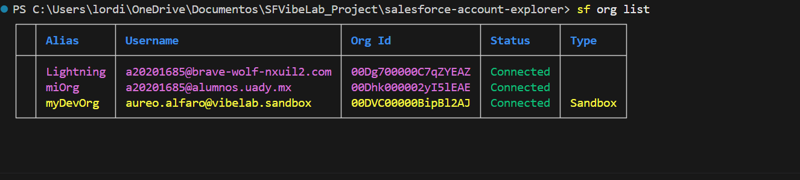
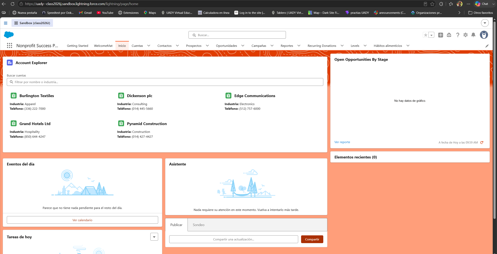
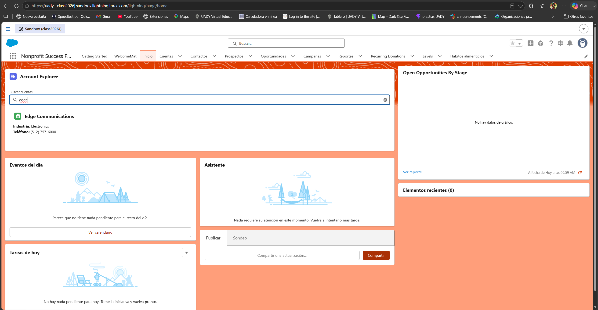
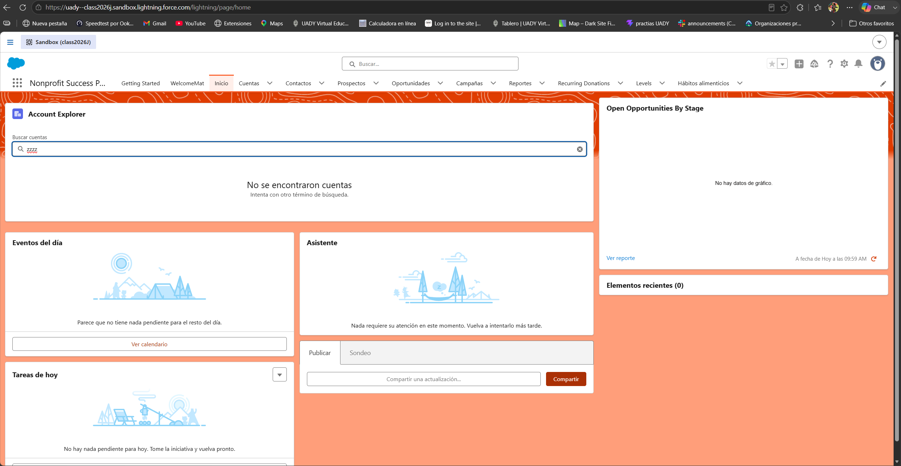
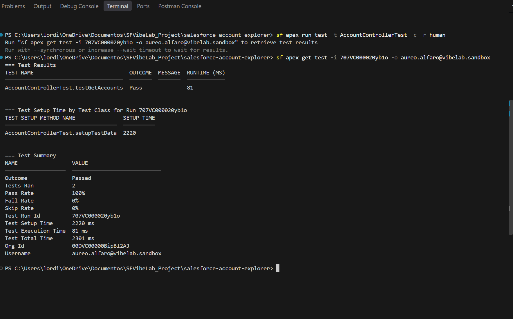
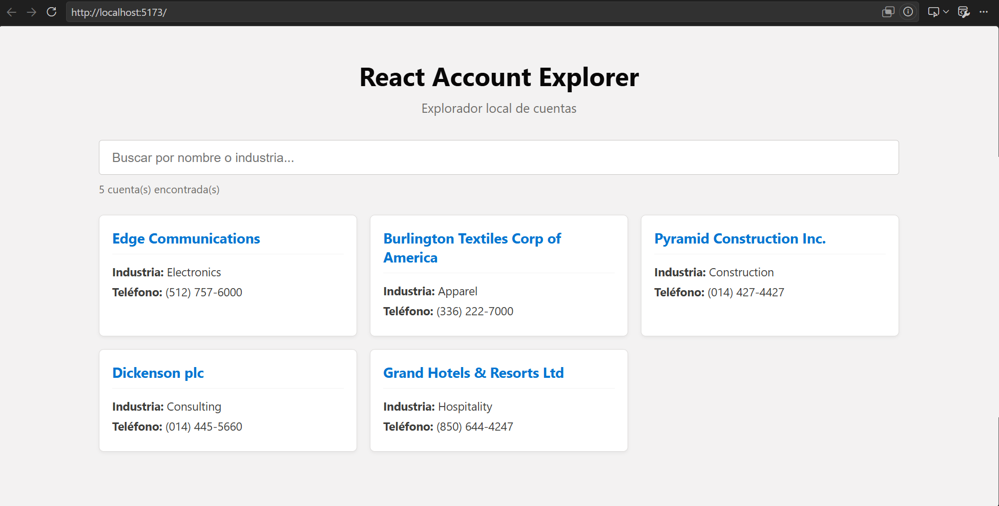
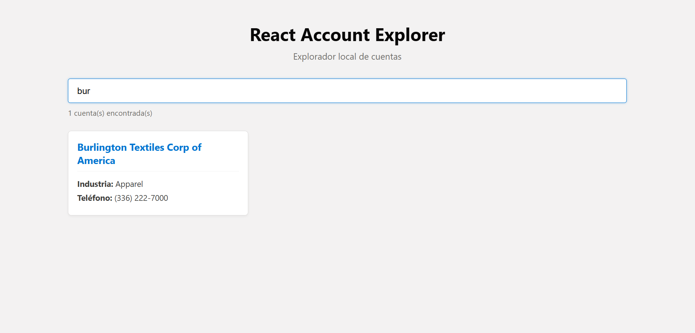
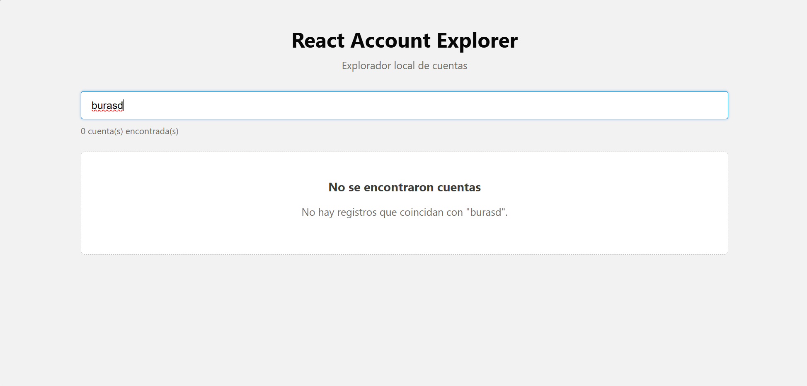
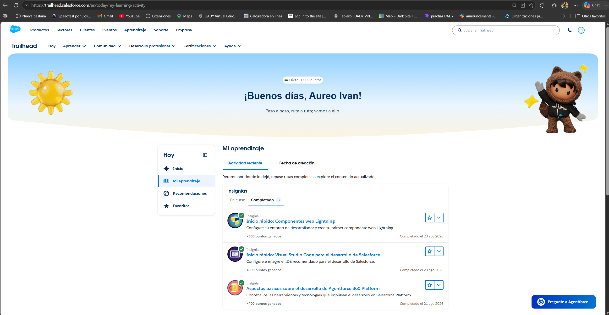

# Professional Readiness Sprint — Aureo Alfaro


Individual submission for the **SF Vibe Lab Professional Readiness Sprint (UADY)**.


This repository contains two applications that browse the same kind of data — company accounts — built on two different stacks: a **Lightning Web Component (LWC)** running inside a Salesforce org against live records, and a local **React application** running against a static JSON file.


---


## Contents


| Folder / File | What it is |
| :--- | :--- |
| `salesforce-account-explorer/` | Salesforce DX project: the Account Explorer LWC and its Apex controller. |
| `react-account-explorer/` | Local React application built with Vite and modular components. |
| `Evidence/` | Screenshots and visual evidence demonstrating environment, LWC, React, and tests. |
| `AI_WORK_LOG.md` | Full disclosure and formal log of AI assistance, problems detected, and manual corrections made. |
| `README.md` | Comprehensive documentation, setup guide, architecture mapping, and project overview. |

---

## Quick Start

Each application has its own setup instructions. Neither depends on the other.

### 1. React Account Explorer
1. Navigate to the project folder:
```bash
   cd react-account-explorer

```

2. Install dependencies:
```bash
npm install

```


3. Start the local Vite server:
```bash
npm run dev

```


4. Open the local URL displayed in the terminal (usually `http://localhost:5173`).

---

### 2. Salesforce LWC (Account Explorer)

1. Navigate to the Salesforce DX folder:
```bash
cd salesforce-account-explorer

```


2. Authenticate against your development/sandbox org:
```bash
sf org login web --alias sprintorg --instance-url [https://test.salesforce.com](https://test.salesforce.com) --set-default

```


> *Note: Sandbox users require the `--instance-url https://test.salesforce.com` flag instead of `login.salesforce.com`.*


3. Deploy source to the org:
```bash
sf project deploy start

```


4. Open your default org and check the component placed on the Home page:
```bash
sf org open

```


---

## Evidence

### 1. Development Environment

Demonstration of the Salesforce CLI connected to the authorized UADY Sandbox org.


*Figure 1: Salesforce CLI org list confirming active default sandbox authentication.*

---

### 2. Salesforce Account Explorer (LWC + Apex)

Demonstration of the component rendering database records, reactive search filtering, empty state handling, and Apex test execution.


*Figure 2: Account Explorer LWC mounted on the Home page displaying accounts with Name, Industry, and Phone.*


*Figure 3: Real-time search filtering records dynamically.*


*Figure 4: Empty state message displayed when no search results match.*


*Figure 5: Successful execution of AccountControllerTest with 100% code coverage.*

---

### 3. React Account Explorer (Local Client)

Demonstration of the standalone React interface consuming static JSON data.


*Figure 6: React application running locally via Vite rendering mock account cards.*


*Figure 7: Client-side dynamic filtering across name and industry fields.*


*Figure 8: Dedicated empty state view when no matching items exist.*

---

### 4. Trailhead Badges

Proof of completion for the three required Trailhead badges on the public profile.


*Figure 9: Completed Trailhead badges for Agentforce 360, VS Code Quick Start, and LWC Quick Start.*

---

## Trailhead Assignments

| Assignment | Status |
| --- | --- |
| **Agentforce 360 Platform Development Basics** | Completed |
| **Quick Start: Visual Studio Code for Salesforce Development** | Completed |
| **Quick Start: Lightning Web Components** | Completed |

---

## How the Two Applications Relate

Both render a searchable list of accounts showing **Name**, **Industry**, and **Phone**. Both filter live on every keystroke, case-insensitively, on the `Name` and `Industry` fields. Both display a dedicated empty state when nothing matches, and both sort results cleanly.

### Where the Work Happens:

* **React App:** Imports a local JSON dataset (`Account_Sample_Data.json`) bundled directly into the client-side JavaScript. The data stays in memory, and filtering is executed entirely on the client using Array methods (`.filter()`).
* **Salesforce LWC:** Holds no local mock data. It invokes an `@AuraEnabled(cacheable=true)` Apex controller (`AccountController.cls`) over the network, which queries the database records using SOQL (`SELECT Id, Name, Industry, Phone FROM Account`). The component manages an explicit loading state (`lightning-spinner`) while the asynchronous wire request resolves.

---

## Component Architecture & Mapping

* **Container Logic:** `App.jsx` in React mirrors `accountExplorer.js` in LWC.
* **Search Input:** The `<input>` field in React mirrors `<lightning-input type="search">` in LWC.
* **Card Display:** The modular `<AccountCard />` in React mirrors the iterated template cards styled with SLDS in LWC.
* **Empty State:** The conditional empty branch in React mirrors the `<template if:false={hasAccounts}>` branch in LWC.

---

## Repository Structure

```text
SFVibeLab_Project/
├── Evidence/
│   ├── 01_env_org_list.png
│   ├── 02_lwc_home_view.png
│   ├── 03_lwc_search_filter.png
│   ├── 04_lwc_empty_state.png
│   ├── 05_apex_test_success.png
│   ├── 06_react_home_view.png
│   ├── 07_react_search_filter.png
│   ├── 08_react_empty_state.png
│   └── 09_trailhead_profile.png
├── react-account-explorer/
│   ├── src/
│   │   ├── components/
│   │   │   ├── AccountCard.jsx
│   │   │   └── AccountCard.css
│   │   ├── data/
│   │   │   └── Account_Sample_Data.json
│   │   ├── App.jsx
│   │   └── main.jsx
│   └── package.json
├── salesforce-account-explorer/
│   ├── force-app/main/default/
│   │   ├── classes/
│   │   │   ├── AccountController.cls
│   │   │   ├── AccountController.cls-meta.xml
│   │   │   ├── AccountControllerTest.cls
│   │   │   └── AccountControllerTest.cls-meta.xml
│   │   └── lwc/
│   │       └── accountExplorer/
│   │           ├── accountExplorer.html
│   │           ├── accountExplorer.js
│   │           └── accountExplorer.js-meta.xml
│   └── sfdx-project.json
├── .gitignore
├── AI_WORK_LOG.md
└── README.md

```

> **Isolation Principle:** The two projects are siblings and never import from each other. No file under `react-account-explorer/` references anything under `salesforce-account-explorer/`. That separation is deliberate — the React application has no live Salesforce integration.

---

## AI Use & Transparency

AI assistance was used transparently to support scaffolding, troubleshooting, and code quality audits. Complete details, individual prompts, errors encountered, and manual fixes are documented in [AI_WORK_LOG.md](./AI_WORK_LOG.md).

```

```